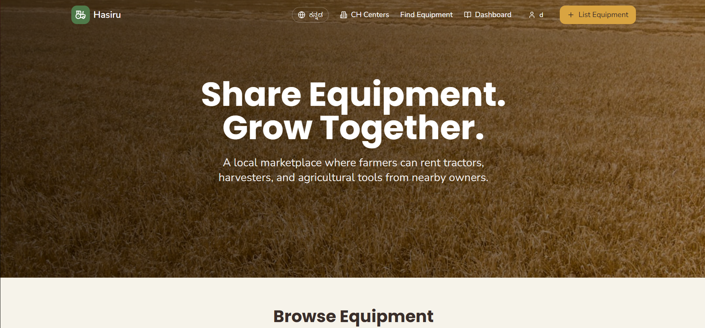
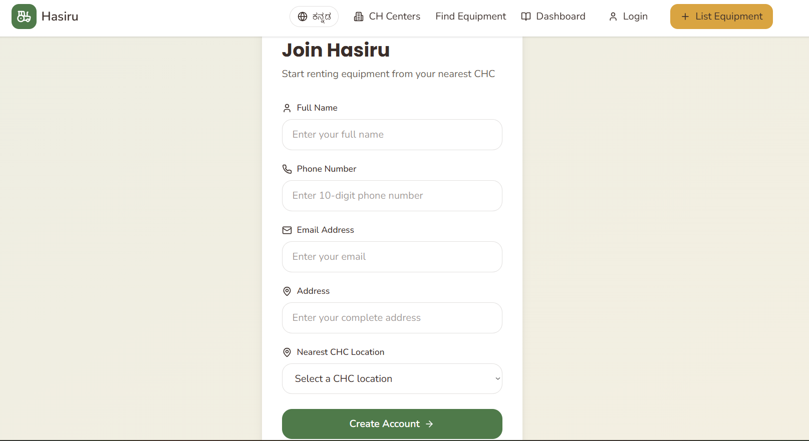
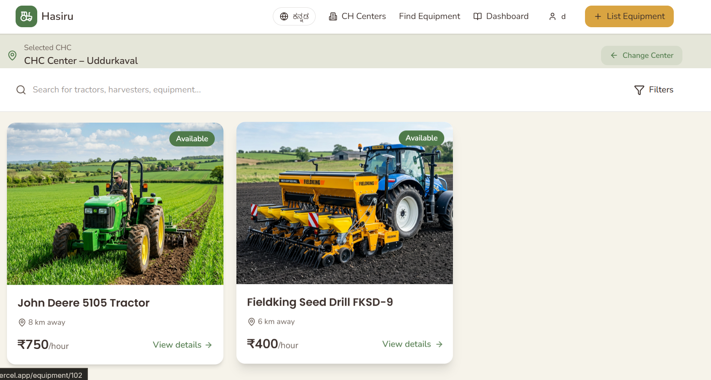
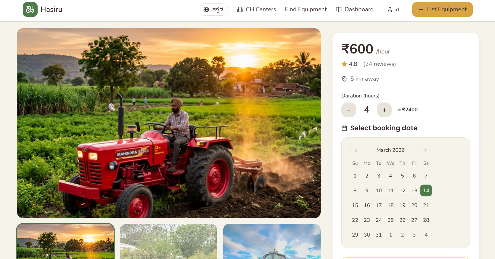

<a id="readme-top"></a>

<div align="center">
  

  <h1 align="center">Hasiru</h1>

  <p align="center">
    A smart farm equipment rental platform connecting farmers, equipment owners, and CHC hubs.
    <br />
    Making agricultural machinery more accessible, discoverable, and rentable.
  </p>

  <p align="center">
    <a href="https://github.com/Nekyo7/Hasiru">View Repository</a>
    ·
    <a href="https://v0-hasiru.vercel.app">Live Demo</a>
  </p>
</div>

---

## Preview

<div align="center">
  
</div>

---

## About The Project

Hasiru is a farm equipment rental and discovery platform designed to help users access agricultural machinery through nearby CHC hubs.

Instead of farmers needing to own every machine themselves, Hasiru helps them:

- discover available equipment nearby
- list machinery for rent
- choose the CHC hub where equipment will be rented
- improve equipment utilization
- simplify the farm rental process digitally

This creates value for both equipment owners and farmers by reducing idle machinery and improving access to tools.

---

## Features

- User-friendly landing page
- Equipment discovery page
- Equipment detail pages
- List Equipment form
- CHC hub selection for equipment rentals
- Map-based equipment browsing
- Supabase backend integration
- Vercel deployment
- Local fallback support for selected development flows

---

## Built With

- React
- TypeScript
- Vite
- Supabase
- React Router
- Vercel

---

## Screenshots

### Landing Page

<div align="center">
  
</div>

The landing page introduces the platform and gives users a quick overview of Hasiru’s purpose and flow.

---

### Discovery Page

<div align="center">
  
</div>

Users can browse available farm equipment and discover machinery listed for rental.

---

### Equipment Listing Page

Equipment owners can submit their machinery, enter details, and choose the CHC hub for rental.

---

### Equipment Detail Page

<div align="center">
  
</div>

Detailed equipment pages show more information about listed machinery.

---

## Getting Started

### Prerequisites

Make sure you have:

- Node.js
- npm

Check versions:

```sh
node -v
npm -v
